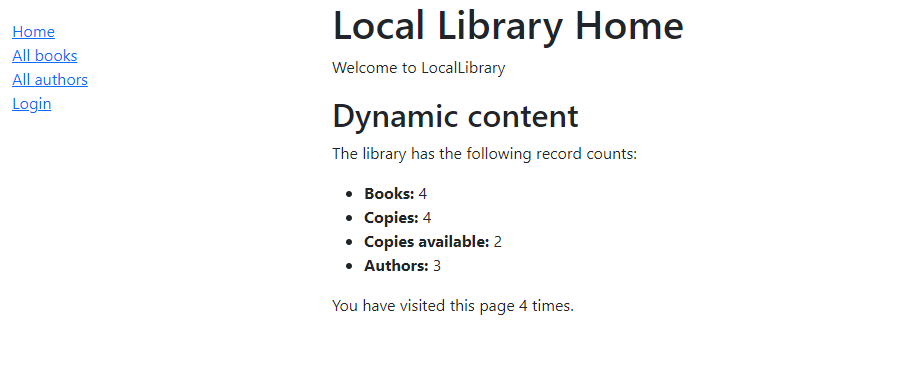

## Welcome to Web Library
Tutorial "Library" website written in Django.
### Overview
This project creates an online catalog of books, where users can add browse available boobs and
manage their accounts.

We will see the starter page which displays Dynamic content and times you visit current page. 
### Optional
For more information about **Model**, **Views**, **Django templates** you can check the following links in the project folder:
- WebLib/models.py
- WebLib/views.py
- WebLib/forms.py
### To run this application
- Clone this repo to directory you prefer
- Create virtual environment **venv** in your CLI use **python -m venv venv** or **pip install virtualenv** than activate in cmd **venv\Scripts\activate.bat**
- Run application **python manage.py runserver**
### Scrapper
I made a scrapper for all books and possible links on the page **[Scrapper](https://github.com/Denyss-stack/Scrapper_for_Library)**

